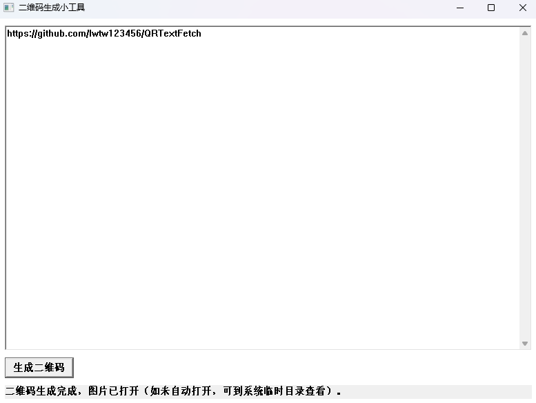

# QRTextFetch
> 将内网文本通过二维码安全、便捷地带到外网环境的小工具。


------------------------------------------------------------------------

## 项目简介

在很多政企/内网环境中，电脑无法直接访问外网，但又经常需要把一小段配置、命令、日志或文字材料带到外网机器上继续处理。  
本项目提供一个**纯本地、零依赖、支持 Windows 7 的二维码中转工具**：

- 在 **内网电脑** 上运行本程序，将文本粘贴进来生成二维码；  
- 使用 **外网环境的手机或电脑** 扫描二维码，即可快速把文本带出内网；  
- 整个过程无需网络连接，也无需安装额外运行库。

## 功能特性

- 🧱 **适配老环境**：支持 **Windows 7 及以上** 系统
- 📦 **零运行时依赖**：静态链接，生成单一 `qrcode.exe` 可执行文件，拷贝即可使用
- 🌐 **无需联网**：二维码生成在本地完成，适用于内网/物理隔离环境
- 📝 **专注文本中转**：面向配置、命令、验证码、URL、短文本等场景
- ⚙️ **自动配置参数**：根据输入文本长度，自动选择合适的版本和纠错等级，在保证可识别性的同时尽量减小体积
- 🖨️ **可截图或拍照**：二维码可在屏幕上展示，由外网设备扫码获取

> **注意**：本工具仅解决「把文本带出去」的问题，不处理任何网络通信或加解密逻辑，是否允许在本单位环境中使用，请遵守所在单位的安全/保密制度。

## 编译说明

本项目使用 **GCC / g++** 在 Windows 上进行编译，依赖以下源文件：

- `main.cpp`
- `qrcodegen.cpp`
- `lodepng.cpp`

推荐使用 MinGW-w64 或类似环境，使用 C++17 标准与静态链接：

```bash
g++ main.cpp qrcodegen.cpp lodepng.cpp \
  -o qrcode.exe \
  -std=gnu++17 \
  -static -static-libgcc -static-libstdc++ \
  -municode -mwindows
```

编译完成后，将得到一个单文件可执行程序：`qrcode.exe`，可直接在目标 Windows 机器上运行。

### 编译参数说明

- `-std=gnu++17`：启用 C++17 标准
- `-static -static-libgcc -static-libstdc++`：静态链接，减少对系统环境的依赖
- `-municode`：使用 Windows 宽字符入口（支持 Unicode）
- `-mwindows`：构建为 GUI 程序而非控制台程序

## 使用方法

以下为典型的内外网中转场景示例，可根据实际界面与交互细节进行调整：

1. **在内网电脑上运行 `qrcode.exe`**
   - 打开程序后，会看到文本输入区域与二维码展示区域。

2. **在内网中粘贴/输入要带出的文本**
   - 如：一段配置、命令行、接口返回的关键信息、短日志片段等。
   - 建议控制单次文本长度，避免二维码过于复杂导致识别困难。

3. **生成二维码**
   - 点击「生成」或相应按钮，程序会在界面中显示对应的二维码。
   - 如果支持，可以将二维码导出为图片文件，便于留存或打印。

4. **在外网设备上扫描获取文本**
   - 使用手机上的扫码 App、浏览器或其他二维码识别工具，对着屏幕上的二维码进行扫描。
   - 扫描后即可在外网设备上获得原始文本内容，实现从内网到外网的「离线拷贝」。

## 使用场景示例

- 在内网开发环境中，将一小段调试日志带到外网进行分析；
- 在税务、政务、金融等封闭网络中，将一条命令或配置复制到个人电脑；
- 内外网切换麻烦时，通过手机充当「中转工具」，快速搬运少量文本。

## 安全与合规提示

- 请务必遵守所在单位的 **信息安全、保密及数据合规制度**；
- 不要使用本工具传输涉密信息或明确禁止外传的内容；
- 建议仅用于「非敏感的零散文本」中转场景。

## 开源协议

本项目以 MIT 协议开源，你可以自由地使用、修改和分发，但需在再分发时保留原始版权声明和协议文本。

## 致谢

本项目基于以下组件/算法实现二维码与 PNG 相关功能：

- `qrcodegen`：二维码编码逻辑
- `lodepng`：PNG 图片编码/解码

如在实际项目中使用了第三方代码，请在此补充具体版本与许可证说明。

---

目前该软件的功能能够满足作者的需要，如果未来需要传递更长的文本，可以开发将文字自动分段分成多个二维码展示的功能。
如果你在实际使用或编译过程中遇到问题，可以：

- 检查 g++ 是否为支持 C++17 的版本；
- 确认使用的是支持静态链接的 MinGW-w64 工具链；
- 在不同 Windows 版本（尤其是 Windows 7）上进行实际运行测试。

祝你使用顺利，也欢迎在开源仓库中提交 Issue 或 PR 一起完善这个小工具。
